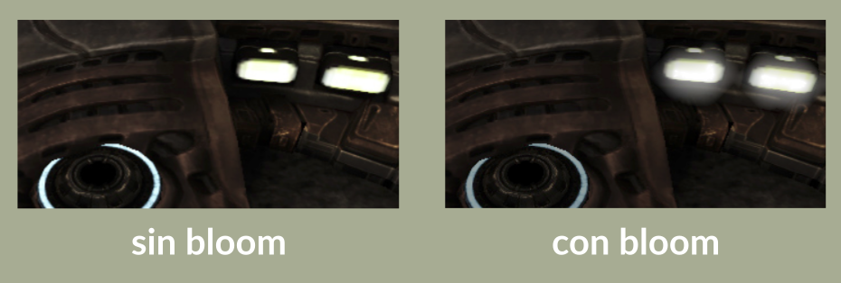

# Efecto Bloom #

Script simple en Python para difuminar colores de imágenes por medio de ecuaciones diferenciales parciales (EDPs).

(Imagen proveniente de [LearnOpenGL](https://learnopengl.com/). Ver la imagen en su página sobre 
[Bloom Effect](https://learnopengl.com/Advanced-Lighting/Bloom) para comparar los resultados.)

## Instrucciones de Ejecución ##

El programa se ejecuta con los siguientes argumentos:

    python bloom_effect.py [-h] [--reinhard] image_filename N R G B

* `image_filename` es la ruta de la imagen a la cuál se le aplicará el efecto
* `N` es el radio de la difuminación
* `R`, `G`, `B` corresponden a las componentes RGB del color a difuminar, dado en un rango entero de [0,255]

Los argumentos en brackets son opcionales: 
* `[-h]` muestra en la consola una ayuda respecto a
cómo usar los comandos
* `[–reinhard]` realiza un *mapeo de Reihard* sobre los píxeles de la imagen
de salida para devolverlos al bajo rango dinámico. Si se omite esta opción, a los píxeles se les aplica clamping.
  
La salida del programa es una imagen de mismo formato de la imagen original, con la misma ruta y agregando *_out* al final del nombre. 
Por ejemplo, si la ruta de la imagen de entrada es `examples/sample_image.png`, la ruta de la imagen de salida será `examples/sample_image_out.png`.

### Requerimientos ###

Python 3 o superior.

Este programa usa las librerías `numpy`, `matplotlib.image` y `scipy`.

## Créditos ##
Realizado como tarea para el curso Modelación y Computación Gráfica para Ingenieros (CC3501) de la Universidad de Chile,
del semestre de primavera 2020.

### Autor ###

Valentina Garrido, 2020.